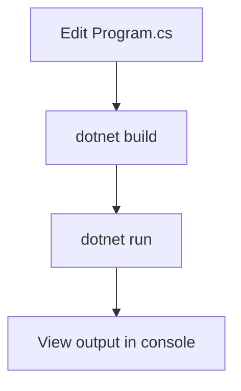

# Algorithm Workflow

The following diagram illustrates how to test any algorithm with your own data.

1. **Edit `Program.cs`** – Call the desired algorithm and provide your input arrays or strings.
2. **Build** – Run `dotnet build` from the `DotNetInterviewProblems` directory.
3. **Run** – Execute `dotnet run` to see the result printed to the console.

This mirrors the workflow of running code on LeetCode, but locally.
